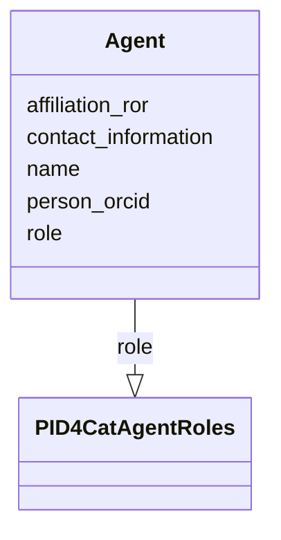

# Class: Agent


_Person who plays a role relative to PID creation or curation._


URI: [pid4cat_model:Agent](https://w3id.org/nfdi4cat/pid4cat-model/Agent)





<!-- no inheritance hierarchy -->


## Slots

| Name | Cardinality and Range | Description | Inheritance |
| ---  | --- | --- | --- |
| [name](name.md) | 0..1 <br/> [String](String.md) | The name of the agent | direct |
| [contact_information](contact_information.md) | 0..1 <br/> [String](String.md) | Identification of the agent that registered the PID, with contact information | direct |
| [person_orcid](person_orcid.md) | 0..1 <br/> [String](String.md) | The ORCID of the person | direct |
| [affiliation_ror](affiliation_ror.md) | 0..1 <br/> [String](String.md) | The ROR of the affiliation | direct |
| [role](role.md) | 0..1 <br/> [PID4CatAgentRoles](PID4CatAgentRoles.md) | The role of the agent relative to the resource | direct |


## Usages

| used by | used in | type | used |
| ---  | --- | --- | --- |
| [PID4CatRelation](PID4CatRelation.md) | [has_agent](has_agent.md) | range | [Agent](Agent.md) |
| [LogRecord](LogRecord.md) | [has_agent](has_agent.md) | range | [Agent](Agent.md) |


## Identifier and Mapping Information


### Schema Source


* from schema: https://w3id.org/nfdi4cat/pid4cat-model


## Mappings

| Mapping Type | Mapped Value |
| ---  | ---  |
| self | pid4cat_model:Agent |
| native | pid4cat_model:Agent |


## LinkML Source

<!-- TODO: investigate https://stackoverflow.com/questions/37606292/how-to-create-tabbed-code-blocks-in-mkdocs-or-sphinx -->

### Direct

<details>
```yaml
name: Agent
description: Person who plays a role relative to PID creation or curation.
from_schema: https://w3id.org/nfdi4cat/pid4cat-model
slots:
- name
- contact_information
- person_orcid
- affiliation_ror
- role

```
</details>

### Induced

<details>
```yaml
name: Agent
description: Person who plays a role relative to PID creation or curation.
from_schema: https://w3id.org/nfdi4cat/pid4cat-model
attributes:
  name:
    name: name
    description: The name of the agent
    from_schema: https://w3id.org/nfdi4cat/pid4cat-model
    rank: 1000
    slot_uri: schema:name
    alias: name
    owner: Agent
    domain_of:
    - Agent
    range: string
  contact_information:
    name: contact_information
    description: Identification of the agent that registered the PID, with contact
      information. Should include person name and affiliation, or position name and
      affiliation, or just organization name. e-mail address is preferred contact
      information.
    from_schema: https://w3id.org/nfdi4cat/pid4cat-model
    rank: 1000
    slot_uri: schema:email
    alias: contact_information
    owner: Agent
    domain_of:
    - Agent
    range: string
  person_orcid:
    name: person_orcid
    description: The ORCID of the person
    from_schema: https://w3id.org/nfdi4cat/pid4cat-model
    rank: 1000
    slot_uri: schema:identifier
    alias: person_orcid
    owner: Agent
    domain_of:
    - Agent
    range: string
  affiliation_ror:
    name: affiliation_ror
    description: The ROR of the affiliation
    from_schema: https://w3id.org/nfdi4cat/pid4cat-model
    rank: 1000
    slot_uri: schema:identifier
    alias: affiliation_ror
    owner: Agent
    domain_of:
    - Agent
    range: string
  role:
    name: role
    description: The role of the agent relative to the resource
    from_schema: https://w3id.org/nfdi4cat/pid4cat-model
    rank: 1000
    slot_uri: schema:identifier
    alias: role
    owner: Agent
    domain_of:
    - Agent
    range: PID4CatAgentRoles

```
</details>