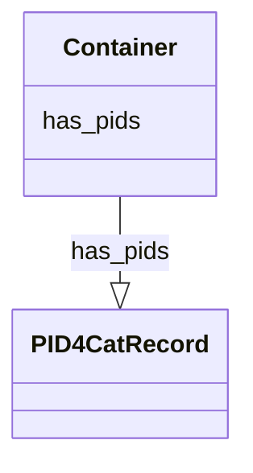

# Class: Container


_A container for all PID4Cat instances._


URI: [pid4cat_model:Container](https://w3id.org/nfdi4cat/pid4cat-model/Container)





<!-- no inheritance hierarchy -->


## Slots

| Name | Cardinality and Range | Description | Inheritance |
| ---  | --- | --- | --- |
| [has_pids](has_pids.md) | 0..* <br/> [PID4CatRecord](PID4CatRecord.md) | The PID4CatRecords contained in the container | direct |


## Identifier and Mapping Information


### Schema Source


* from schema: https://w3id.org/nfdi4cat/pid4cat-model


## Mappings

| Mapping Type | Mapped Value |
| ---  | ---  |
| self | pid4cat_model:Container |
| native | pid4cat_model:Container |


## LinkML Source

<!-- TODO: investigate https://stackoverflow.com/questions/37606292/how-to-create-tabbed-code-blocks-in-mkdocs-or-sphinx -->

### Direct

<details>
```yaml
name: Container
description: A container for all PID4Cat instances.
from_schema: https://w3id.org/nfdi4cat/pid4cat-model
attributes:
  has_pids:
    name: has_pids
    description: The PID4CatRecords contained in the container.
    from_schema: https://w3id.org/nfdi4cat/pid4cat-model
    rank: 1000
    multivalued: true
    range: PID4CatRecord
    inlined: true
    inlined_as_list: true
tree_root: true

```
</details>

### Induced

<details>
```yaml
name: Container
description: A container for all PID4Cat instances.
from_schema: https://w3id.org/nfdi4cat/pid4cat-model
attributes:
  has_pids:
    name: has_pids
    description: The PID4CatRecords contained in the container.
    from_schema: https://w3id.org/nfdi4cat/pid4cat-model
    rank: 1000
    multivalued: true
    alias: has_pids
    owner: Container
    domain_of:
    - Container
    range: PID4CatRecord
    inlined: true
    inlined_as_list: true
tree_root: true

```
</details>