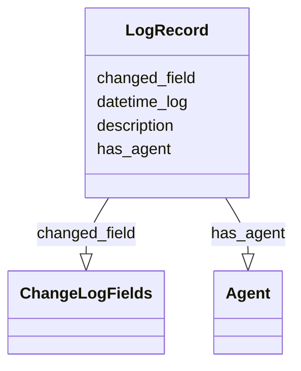

# Class: LogRecord


_A log record for changes made on a PID4CatRecord starting from registration._


URI: [pid4cat_model:LogRecord](https://w3id.org/nfdi4cat/pid4cat-model/LogRecord)





<!-- no inheritance hierarchy -->


## Slots

| Name | Cardinality and Range | Description | Inheritance |
| ---  | --- | --- | --- |
| [datetime_log](datetime_log.md) | 0..1 <br/> [String](String.md) | The date and time of a log record | direct |
| [has_agent](has_agent.md) | 0..1 <br/> [Agent](Agent.md) | The person who registered the resource | direct |
| [changed_field](changed_field.md) | 0..1 <br/> [ChangeLogFields](ChangeLogFields.md) | The field that was changed | direct |
| [description](description.md) | 0..1 <br/> [String](String.md) | A human-readable description for a thing | direct |


## Usages

| used by | used in | type | used |
| ---  | --- | --- | --- |
| [PID4CatRecord](PID4CatRecord.md) | [change_log](change_log.md) | range | [LogRecord](LogRecord.md) |


## Identifier and Mapping Information


### Schema Source


* from schema: https://w3id.org/nfdi4cat/pid4cat-model


## Mappings

| Mapping Type | Mapped Value |
| ---  | ---  |
| self | pid4cat_model:LogRecord |
| native | pid4cat_model:LogRecord |


## LinkML Source

<!-- TODO: investigate https://stackoverflow.com/questions/37606292/how-to-create-tabbed-code-blocks-in-mkdocs-or-sphinx -->

### Direct

<details>
```yaml
name: LogRecord
description: A log record for changes made on a PID4CatRecord starting from registration.
from_schema: https://w3id.org/nfdi4cat/pid4cat-model
slots:
- datetime_log
- has_agent
- changed_field
- description

```
</details>

### Induced

<details>
```yaml
name: LogRecord
description: A log record for changes made on a PID4CatRecord starting from registration.
from_schema: https://w3id.org/nfdi4cat/pid4cat-model
attributes:
  datetime_log:
    name: datetime_log
    description: The date and time of a log record
    from_schema: https://w3id.org/nfdi4cat/pid4cat-model
    rank: 1000
    slot_uri: schema:DateTime
    alias: datetime_log
    owner: LogRecord
    domain_of:
    - PID4CatRelation
    - LogRecord
    range: string
  has_agent:
    name: has_agent
    description: The person who registered the resource
    from_schema: https://w3id.org/nfdi4cat/pid4cat-model
    rank: 1000
    slot_uri: schema:Agent
    alias: has_agent
    owner: LogRecord
    domain_of:
    - PID4CatRelation
    - LogRecord
    range: Agent
  changed_field:
    name: changed_field
    description: The field that was changed
    from_schema: https://w3id.org/nfdi4cat/pid4cat-model
    rank: 1000
    slot_uri: schema:identifier
    alias: changed_field
    owner: LogRecord
    domain_of:
    - LogRecord
    range: ChangeLogFields
  description:
    name: description
    description: A human-readable description for a thing
    from_schema: https://w3id.org/nfdi4cat/pid4cat-model
    rank: 1000
    slot_uri: schema:description
    alias: description
    owner: LogRecord
    domain_of:
    - ResourceInfo
    - LogRecord
    range: string

```
</details>