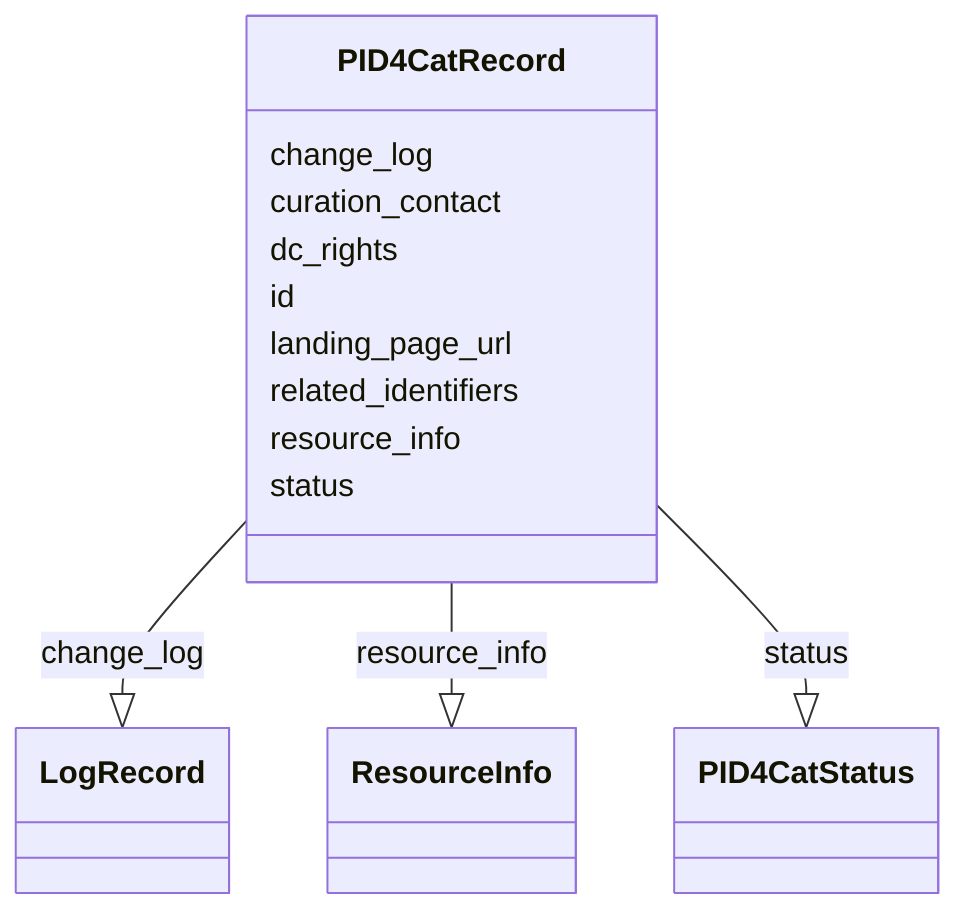

# Class: PID4CatRecord


_Represents a PID4CatRecord_


URI: [pid4cat_model:PID4CatRecord](https://w3id.org/nfdi4cat/pid4cat-model/PID4CatRecord)





<!-- no inheritance hierarchy -->


## Slots

| Name | Cardinality and Range | Description | Inheritance |
| ---  | --- | --- | --- |
| [id](id.md) | 1..1 <br/> [Uriorcurie](Uriorcurie.md) | A unique identifier for a thing | direct |
| [landing_page_url](landing_page_url.md) | 0..1 <br/> [String](String.md) | The URL of the landing page for the resource | direct |
| [status](status.md) | 0..1 <br/> [PID4CatStatus](PID4CatStatus.md) | The status of the PID4CatRecord | direct |
| [resource_info](resource_info.md) | 0..* <br/> [ResourceInfo](ResourceInfo.md) | Information about the resource | direct |
| [related_identifiers](related_identifiers.md) | 0..* <br/> [Uriorcurie](Uriorcurie.md) | Alternate identifiers for the resource | direct |
| [dc_rights](dc_rights.md) | 0..1 <br/> [String](String.md) | The license for the metadata contained in the PID4Cat record | direct |
| [curation_contact](curation_contact.md) | 0..1 <br/> [String](String.md) | The email address of a person or institution responsible for curation of the ... | direct |
| [change_log](change_log.md) | 1..* <br/> [LogRecord](LogRecord.md) | Change log of PID4Cat record | direct |


## Usages

| used by | used in | type | used |
| ---  | --- | --- | --- |
| [Container](Container.md) | [has_pids](has_pids.md) | range | [PID4CatRecord](PID4CatRecord.md) |


## Identifier and Mapping Information


### Schema Source


* from schema: https://w3id.org/nfdi4cat/pid4cat-model


## Mappings

| Mapping Type | Mapped Value |
| ---  | ---  |
| self | pid4cat_model:PID4CatRecord |
| native | pid4cat_model:PID4CatRecord |


## LinkML Source

<!-- TODO: investigate https://stackoverflow.com/questions/37606292/how-to-create-tabbed-code-blocks-in-mkdocs-or-sphinx -->

### Direct

<details>
```yaml
name: PID4CatRecord
description: Represents a PID4CatRecord
from_schema: https://w3id.org/nfdi4cat/pid4cat-model
slots:
- id
- landing_page_url
- status
- resource_info
- related_identifiers
- dc_rights
- curation_contact
- change_log
slot_usage:
  curation_contact:
    name: curation_contact
    domain_of:
    - PID4CatRecord
    pattern: ^\S+@[\S+\.]+\S+

```
</details>

### Induced

<details>
```yaml
name: PID4CatRecord
description: Represents a PID4CatRecord
from_schema: https://w3id.org/nfdi4cat/pid4cat-model
slot_usage:
  curation_contact:
    name: curation_contact
    domain_of:
    - PID4CatRecord
    pattern: ^\S+@[\S+\.]+\S+
attributes:
  id:
    name: id
    description: A unique identifier for a thing
    from_schema: https://w3id.org/nfdi4cat/pid4cat-model
    rank: 1000
    slot_uri: schema:identifier
    identifier: true
    alias: id
    owner: PID4CatRecord
    domain_of:
    - PID4CatRecord
    range: uriorcurie
  landing_page_url:
    name: landing_page_url
    description: The URL of the landing page for the resource
    from_schema: https://w3id.org/nfdi4cat/pid4cat-model
    rank: 10
    slot_uri: schema:url
    alias: landing_page_url
    owner: PID4CatRecord
    domain_of:
    - PID4CatRecord
    range: string
  status:
    name: status
    description: The status of the PID4CatRecord.
    from_schema: https://w3id.org/nfdi4cat/pid4cat-model
    rank: 1000
    alias: status
    owner: PID4CatRecord
    domain_of:
    - PID4CatRecord
    range: PID4CatStatus
  resource_info:
    name: resource_info
    description: Information about the resource.
    from_schema: https://w3id.org/nfdi4cat/pid4cat-model
    rank: 1000
    multivalued: true
    alias: resource_info
    owner: PID4CatRecord
    domain_of:
    - PID4CatRecord
    range: ResourceInfo
  related_identifiers:
    name: related_identifiers
    description: Alternate identifiers for the resource
    from_schema: https://w3id.org/nfdi4cat/pid4cat-model
    rank: 1000
    slot_uri: schema:identifier
    multivalued: true
    alias: related_identifiers
    owner: PID4CatRecord
    domain_of:
    - PID4CatRecord
    range: uriorcurie
  dc_rights:
    name: dc_rights
    description: The license for the metadata contained in the PID4Cat record.
    from_schema: https://w3id.org/nfdi4cat/pid4cat-model
    rank: 1000
    slot_uri: schema:license
    alias: dc_rights
    owner: PID4CatRecord
    domain_of:
    - PID4CatRecord
    range: string
  curation_contact:
    name: curation_contact
    description: The email address of a person or institution responsible for curation
      of the resource.
    from_schema: https://w3id.org/nfdi4cat/pid4cat-model
    rank: 1000
    slot_uri: schema:email
    alias: curation_contact
    owner: PID4CatRecord
    domain_of:
    - PID4CatRecord
    range: string
    pattern: ^\S+@[\S+\.]+\S+
  change_log:
    name: change_log
    description: Change log of PID4Cat record
    from_schema: https://w3id.org/nfdi4cat/pid4cat-model
    rank: 1000
    slot_uri: schema:identifier
    multivalued: true
    alias: change_log
    owner: PID4CatRecord
    domain_of:
    - PID4CatRecord
    range: LogRecord
    required: true

```
</details>