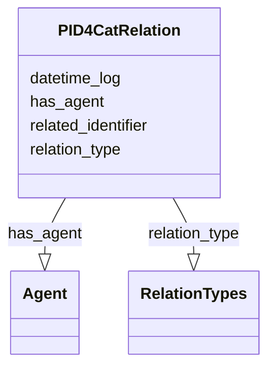

# Class: PID4CatRelation


_A relation between PID4CatRecords or between a PID4CatRecord and other resources with a PID._


URI: [pid4cat_model:PID4CatRelation](https://w3id.org/nfdi4cat/pid4cat-model/PID4CatRelation)





<!-- no inheritance hierarchy -->


## Slots

| Name | Cardinality and Range | Description | Inheritance |
| ---  | --- | --- | --- |
| [relation_type](relation_type.md) | 0..* <br/> [RelationTypes](RelationTypes.md) | Relation type between the resources | direct |
| [related_identifier](related_identifier.md) | 0..1 <br/> [String](String.md) | Related identifiers for the resource | direct |
| [datetime_log](datetime_log.md) | 0..1 <br/> [String](String.md) | The date and time of a log record | direct |
| [has_agent](has_agent.md) | 0..1 <br/> [Agent](Agent.md) | The person who registered the resource | direct |


## Identifier and Mapping Information


### Schema Source


* from schema: https://w3id.org/nfdi4cat/pid4cat-model


## Mappings

| Mapping Type | Mapped Value |
| ---  | ---  |
| self | pid4cat_model:PID4CatRelation |
| native | pid4cat_model:PID4CatRelation |


## LinkML Source

<!-- TODO: investigate https://stackoverflow.com/questions/37606292/how-to-create-tabbed-code-blocks-in-mkdocs-or-sphinx -->

### Direct

<details>
```yaml
name: PID4CatRelation
description: A relation between PID4CatRecords or between a PID4CatRecord and other
  resources with a PID.
from_schema: https://w3id.org/nfdi4cat/pid4cat-model
slots:
- relation_type
- related_identifier
- datetime_log
- has_agent

```
</details>

### Induced

<details>
```yaml
name: PID4CatRelation
description: A relation between PID4CatRecords or between a PID4CatRecord and other
  resources with a PID.
from_schema: https://w3id.org/nfdi4cat/pid4cat-model
attributes:
  relation_type:
    name: relation_type
    description: Relation type between the resources
    from_schema: https://w3id.org/nfdi4cat/pid4cat-model
    rank: 1000
    slot_uri: schema:identifier
    multivalued: true
    alias: relation_type
    owner: PID4CatRelation
    domain_of:
    - PID4CatRelation
    range: RelationTypes
  related_identifier:
    name: related_identifier
    description: Related identifiers for the resource
    from_schema: https://w3id.org/nfdi4cat/pid4cat-model
    rank: 1000
    slot_uri: schema:identifier
    alias: related_identifier
    owner: PID4CatRelation
    domain_of:
    - PID4CatRelation
    range: string
  datetime_log:
    name: datetime_log
    description: The date and time of a log record
    from_schema: https://w3id.org/nfdi4cat/pid4cat-model
    rank: 1000
    slot_uri: schema:DateTime
    alias: datetime_log
    owner: PID4CatRelation
    domain_of:
    - PID4CatRelation
    - LogRecord
    range: string
  has_agent:
    name: has_agent
    description: The person who registered the resource
    from_schema: https://w3id.org/nfdi4cat/pid4cat-model
    rank: 1000
    slot_uri: schema:Agent
    alias: has_agent
    owner: PID4CatRelation
    domain_of:
    - PID4CatRelation
    - LogRecord
    range: Agent

```
</details>