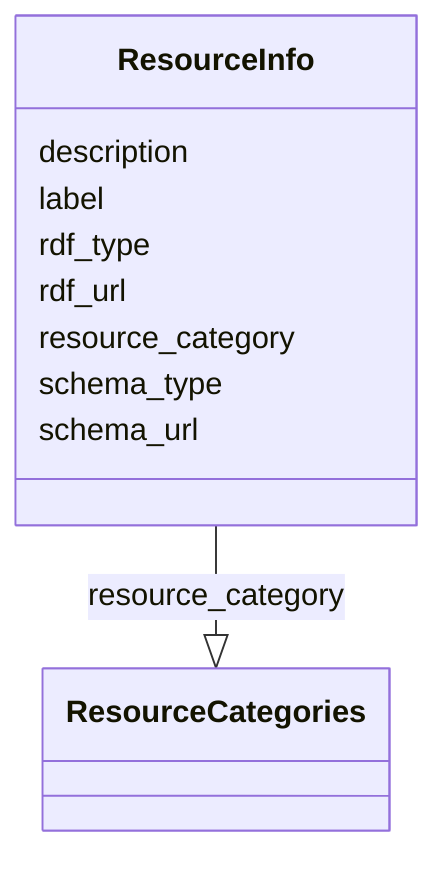

# Class: ResourceInfo


_Data object to hold information about the resource and its representation._


URI: [pid4cat_model:ResourceInfo](https://w3id.org/nfdi4cat/pid4cat-model/ResourceInfo)





<!-- no inheritance hierarchy -->


## Slots

| Name | Cardinality and Range | Description | Inheritance |
| ---  | --- | --- | --- |
| [label](label.md) | 0..1 <br/> [String](String.md) | A human-readable name for a thing | direct |
| [description](description.md) | 0..1 <br/> [String](String.md) | A human-readable description for a thing | direct |
| [resource_category](resource_category.md) | 0..1 <br/> [ResourceCategories](ResourceCategories.md) | The category of the resource | direct |
| [rdf_url](rdf_url.md) | 0..1 <br/> [String](String.md) | The URI of the rdf represenation of the resource | direct |
| [rdf_type](rdf_type.md) | 0..1 <br/> [String](String.md) | The format of the rdf representation of the resource (xml, turlte, json-ld,  | direct |
| [schema_url](schema_url.md) | 0..1 <br/> [String](String.md) | The URI of the schema used to describe the resource | direct |
| [schema_type](schema_type.md) | 0..1 <br/> [String](String.md) | The type of the scheme used to describe the resource | direct |


## Usages

| used by | used in | type | used |
| ---  | --- | --- | --- |
| [PID4CatRecord](PID4CatRecord.md) | [resource_info](resource_info.md) | range | [ResourceInfo](ResourceInfo.md) |


## Identifier and Mapping Information


### Schema Source


* from schema: https://w3id.org/nfdi4cat/pid4cat-model


## Mappings

| Mapping Type | Mapped Value |
| ---  | ---  |
| self | pid4cat_model:ResourceInfo |
| native | pid4cat_model:ResourceInfo |


## LinkML Source

<!-- TODO: investigate https://stackoverflow.com/questions/37606292/how-to-create-tabbed-code-blocks-in-mkdocs-or-sphinx -->

### Direct

<details>
```yaml
name: ResourceInfo
description: Data object to hold information about the resource and its representation.
from_schema: https://w3id.org/nfdi4cat/pid4cat-model
slots:
- label
- description
- resource_category
- rdf_url
- rdf_type
- schema_url
- schema_type

```
</details>

### Induced

<details>
```yaml
name: ResourceInfo
description: Data object to hold information about the resource and its representation.
from_schema: https://w3id.org/nfdi4cat/pid4cat-model
attributes:
  label:
    name: label
    description: A human-readable name for a thing
    from_schema: https://w3id.org/nfdi4cat/pid4cat-model
    rank: 1000
    slot_uri: schema:name
    alias: label
    owner: ResourceInfo
    domain_of:
    - ResourceInfo
    range: string
  description:
    name: description
    description: A human-readable description for a thing
    from_schema: https://w3id.org/nfdi4cat/pid4cat-model
    rank: 1000
    slot_uri: schema:description
    alias: description
    owner: ResourceInfo
    domain_of:
    - ResourceInfo
    - LogRecord
    range: string
  resource_category:
    name: resource_category
    description: The category of the resource
    from_schema: https://w3id.org/nfdi4cat/pid4cat-model
    rank: 1000
    slot_uri: schema:additionalType
    alias: resource_category
    owner: ResourceInfo
    domain_of:
    - ResourceInfo
    range: ResourceCategories
  rdf_url:
    name: rdf_url
    description: 'The URI of the rdf represenation of the resource. '
    from_schema: https://w3id.org/nfdi4cat/pid4cat-model
    rank: 1000
    slot_uri: schema:additionalType
    alias: rdf_url
    owner: ResourceInfo
    domain_of:
    - ResourceInfo
    range: string
  rdf_type:
    name: rdf_type
    description: The format of the rdf representation of the resource (xml, turlte,
      json-ld, ...).
    from_schema: https://w3id.org/nfdi4cat/pid4cat-model
    rank: 1000
    slot_uri: schema:additionalType
    alias: rdf_type
    owner: ResourceInfo
    domain_of:
    - ResourceInfo
    range: string
  schema_url:
    name: schema_url
    description: The URI of the schema used to describe the resource.  Same property
      as in DataCite:schemeURI.
    from_schema: https://w3id.org/nfdi4cat/pid4cat-model
    rank: 1000
    slot_uri: schema:additionalType
    alias: schema_url
    owner: ResourceInfo
    domain_of:
    - ResourceInfo
    range: string
  schema_type:
    name: schema_type
    description: 'The type of the scheme used to describe the resource. Examples:
      XSD, DDT, Turtle Same property as in DataCite:schemeType.'
    from_schema: https://w3id.org/nfdi4cat/pid4cat-model
    rank: 1000
    slot_uri: schema:additionalType
    alias: schema_type
    owner: ResourceInfo
    domain_of:
    - ResourceInfo
    range: string

```
</details>